# 竞赛管理平台 - 流程图

本文档包含基于 `2026-06-08-competition-platform-prd.md` 和 `2026-06-08-competition-platform-design.md` 生成的全部核心流程图。

每张流程图同时提供：
- **Mermaid 源码**（可复制到任意 Mermaid 渲染器）
- **PNG 图片**（位于 [images/](./images/) 目录）

图片文件命名规则：`{序号}_{标题}.png`

---

## 1. 系统架构图

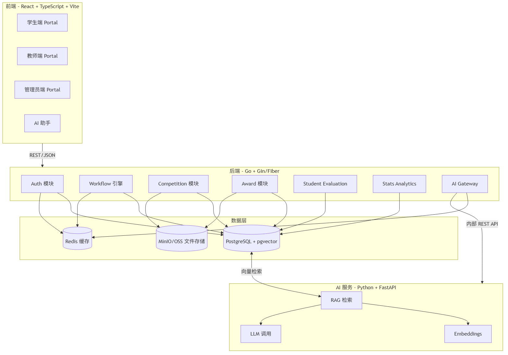

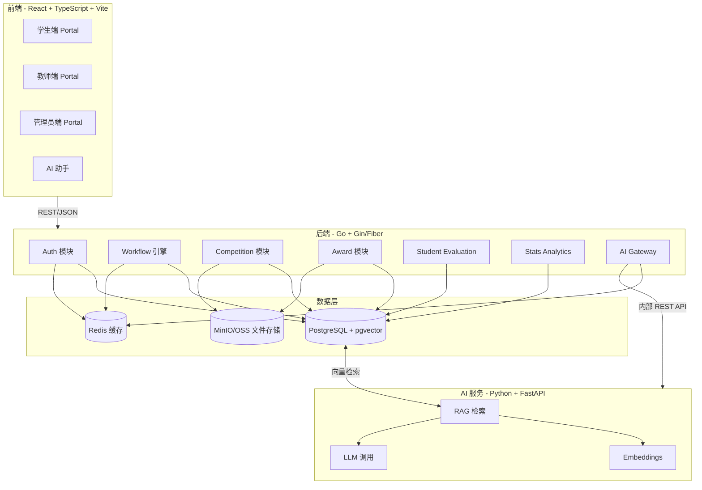
```mermaid
flowchart TB
    subgraph FE[前端 - React + TypeScript + Vite]
        SP[学生端 Portal]
        TP[教师端 Portal]
        AP[管理员端 Portal]
        AI[AI 助手]
    end

    subgraph BE[后端 - Go + Gin/Fiber]
        AUTH[Auth 模块]
        WF[Workflow 引擎]
        COMP[Competition 模块]
        AWD[Award 模块]
        EVAL[Student Evaluation]
        STAT[Stats Analytics]
        AIGW[AI Gateway]
    end

    subgraph AIS[AI 服务 - Python + FastAPI]
        RAG[RAG 检索]
        LLM[LLM 调用]
        EMB[Embeddings]
    end

    subgraph STORE[数据层]
        PG[(PostgreSQL + pgvector)]
        RD[(Redis 缓存)]
        OSS[(MinIO/OSS 文件存储)]
    end

    FE -->|REST/JSON| BE
    AIGW -->|内部 REST API| AIS
    AUTH --> PG
    WF --> PG
    COMP --> PG
    AWD --> PG
    EVAL --> PG
    STAT --> PG
    AUTH --> RD
    WF --> RD
    AIGW --> RD
    COMP --> OSS
    AWD --> OSS
    PG <-->|向量检索| RAG
    RAG --> EMB
    RAG --> LLM
```

---

## 2. 用户注册与登录流程

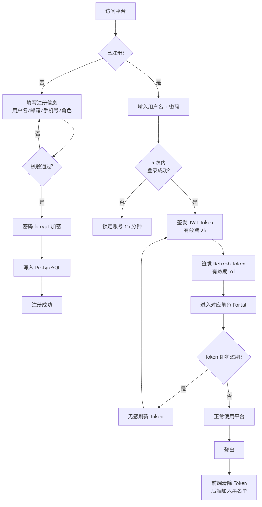

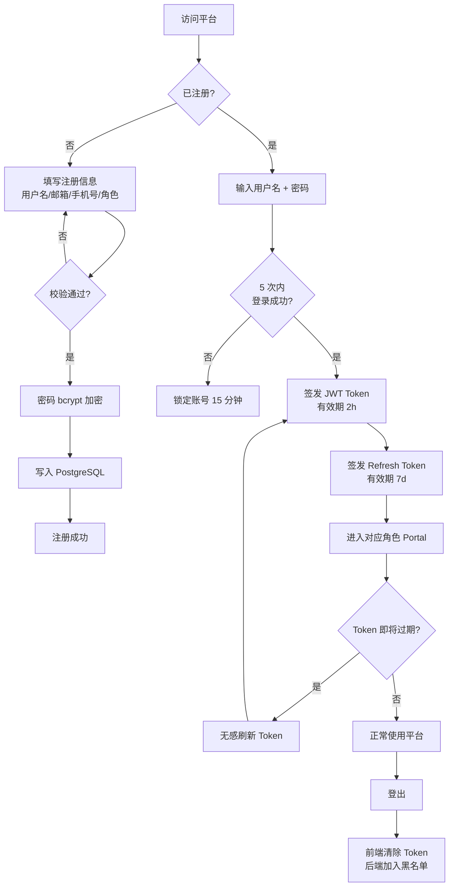
```mermaid
flowchart TD
    A[访问平台] --> B{已注册?}
    B -->|否| C[填写注册信息<br/>用户名/邮箱/手机号/角色]
    C --> D{校验通过?}
    D -->|否| C
    D -->|是| E[密码 bcrypt 加密]
    E --> F[写入 PostgreSQL]
    F --> G[注册成功]
    B -->|是| H[输入用户名 + 密码]
    H --> I{5 次内<br/>登录成功?}
    I -->|否| J[锁定账号 15 分钟]
    I -->|是| K[签发 JWT Token<br/>有效期 2h]
    K --> L[签发 Refresh Token<br/>有效期 7d]
    L --> M[进入对应角色 Portal]
    M --> N{Token 即将过期?}
    N -->|是| O[无感刷新 Token]
    O --> K
    N -->|否| P[正常使用平台]
    P --> Q[登出]
    Q --> R[前端清除 Token<br/>后端加入黑名单]
```

---

## 3. 学生参赛完整流程

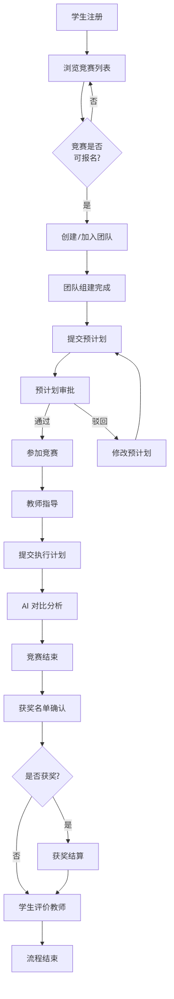

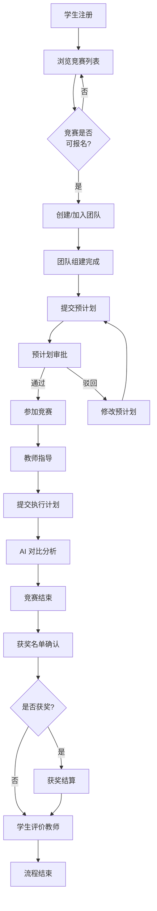
```mermaid
flowchart TD
    A[学生注册] --> B[浏览竞赛列表]
    B --> C{竞赛是否<br/>可报名?}
    C -->|否| B
    C -->|是| D[创建/加入团队]
    D --> E[团队组建完成]
    E --> F[提交预计划]
    F --> G[预计划审批]
    G -->|通过| H[参加竞赛]
    G -->|驳回| F1[修改预计划]
    F1 --> F
    H --> I[教师指导]
    I --> J[提交执行计划]
    J --> K[AI 对比分析]
    K --> L[竞赛结束]
    L --> M[获奖名单确认]
    M --> N{是否获奖?}
    N -->|是| O[获奖结算]
    N -->|否| P[学生评价教师]
    O --> P
    P --> Q[流程结束]
```

---

## 4. 报名审批流程

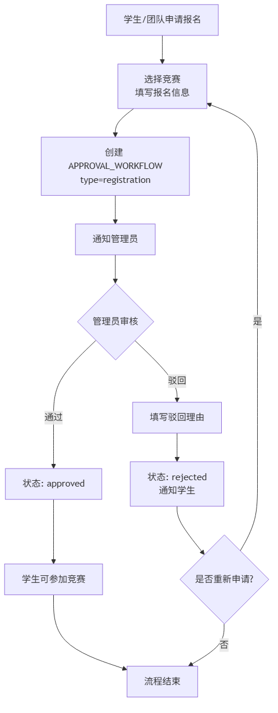

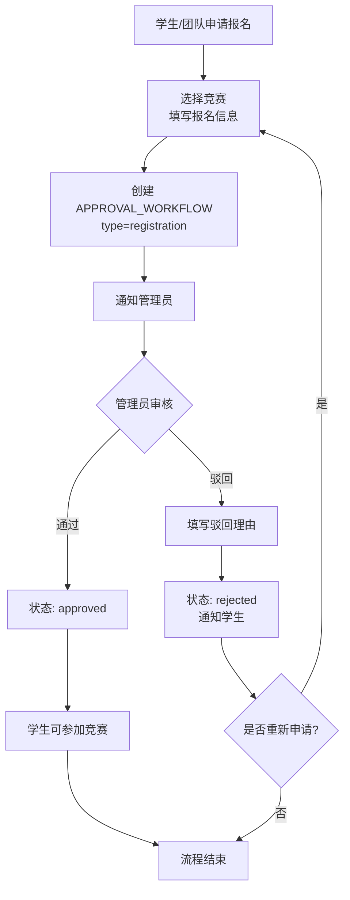
```mermaid
flowchart TD
    A[学生/团队申请报名] --> B[选择竞赛<br/>填写报名信息]
    B --> C[创建 APPROVAL_WORKFLOW<br/>type=registration]
    C --> D[通知管理员]
    D --> E{管理员审核}
    E -->|通过| F[状态: approved]
    E -->|驳回| G[填写驳回理由]
    F --> H[学生可参加竞赛]
    G --> I[状态: rejected<br/>通知学生]
    I --> J{是否重新申请?}
    J -->|是| B
    J -->|否| K[流程结束]
    H --> K
```

---

## 5. 预计划审批流程（含 AI 并行审核）

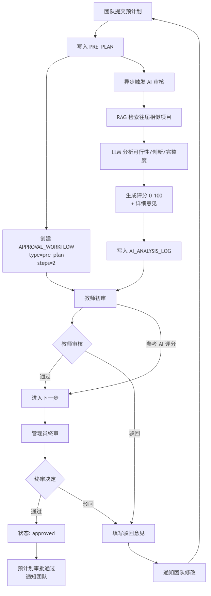

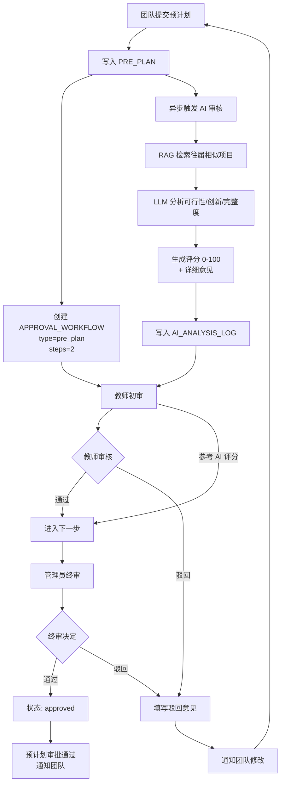
```mermaid
flowchart TD
    A[团队提交预计划] --> B[写入 PRE_PLAN]
    B --> C[创建 APPROVAL_WORKFLOW<br/>type=pre_plan<br/>steps=2]
    B --> D[异步触发 AI 审核]
    D --> D1[RAG 检索往届相似项目]
    D1 --> D2[LLM 分析可行性/创新/完整度]
    D2 --> D3[生成评分 0-100<br/>+ 详细意见]
    D3 --> D4[写入 AI_ANALYSIS_LOG]
    D4 --> E
    C --> E[教师初审]
    E --> E1{教师审核}
    E1 -->|通过| F[进入下一步]
    E1 -->|驳回| G1[填写驳回意见]
    E -->|参考 AI 评分| F
    F --> H[管理员终审]
    H --> H1{终审决定}
    H1 -->|通过| I[状态: approved]
    H1 -->|驳回| G1
    I --> J[预计划审批通过<br/>通知团队]
    G1 --> K[通知团队修改]
    K --> A
```

---

## 6. 奖励审批流程

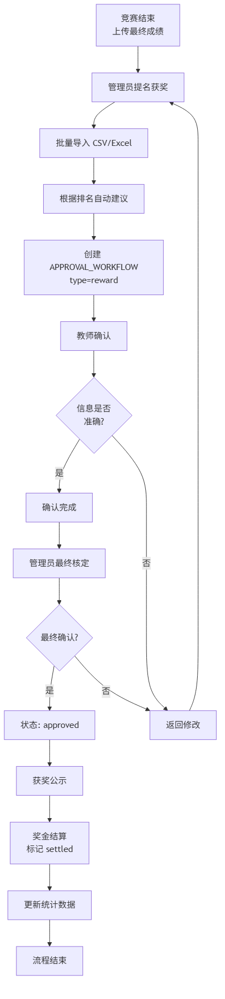

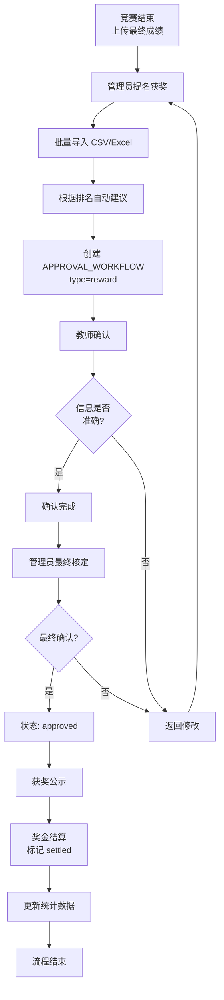
```mermaid
flowchart TD
    A[竞赛结束<br/>上传最终成绩] --> B[管理员提名获奖]
    B --> B1[批量导入 CSV/Excel]
    B1 --> B2[根据排名自动建议]
    B2 --> C[创建 APPROVAL_WORKFLOW<br/>type=reward]
    C --> D[教师确认]
    D --> D1{信息是否<br/>准确?}
    D1 -->|是| E[确认完成]
    D1 -->|否| F1[返回修改]
    F1 --> B
    E --> G[管理员最终核定]
    G --> G1{最终确认?}
    G1 -->|是| H[状态: approved]
    G1 -->|否| F1
    H --> I[获奖公示]
    I --> J[奖金结算<br/>标记 settled]
    J --> K[更新统计数据]
    K --> L[流程结束]
```

---

## 7. AI 智能审核流程（RAG + LLM）

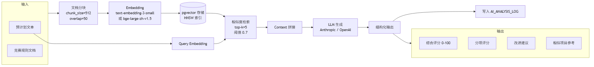

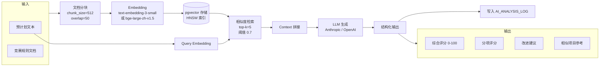
```mermaid
flowchart LR
    subgraph IN[输入]
        A1[预计划文本]
        A2[竞赛规则文档]
    end

    IN --> B[文档分块<br/>chunk_size=512<br/>overlap=50]
    B --> C[Embedding<br/>text-embedding-3-small<br/>或 bge-large-zh-v1.5]
    C --> D[(pgvector 存储<br/>HNSW 索引)]

    A1 --> E[Query Embedding]
    D --> F[相似度检索<br/>top-k=5<br/>阈值 0.7]
    E --> F
    F --> G[Context 拼接]
    G --> H[LLM 生成<br/>Anthropic / OpenAI]
    H --> I[结构化输出]

    subgraph OUT[输出]
        I1[综合评分 0-100]
        I2[分项评分]
        I3[改进建议]
        I4[相似项目参考]
    end

    I --> OUT
    I --> J[写入 AI_ANALYSIS_LOG]
```

---

## 8. 执行计划 AI 对比流程

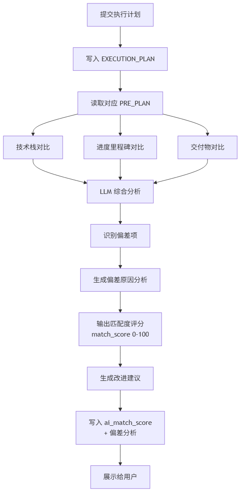

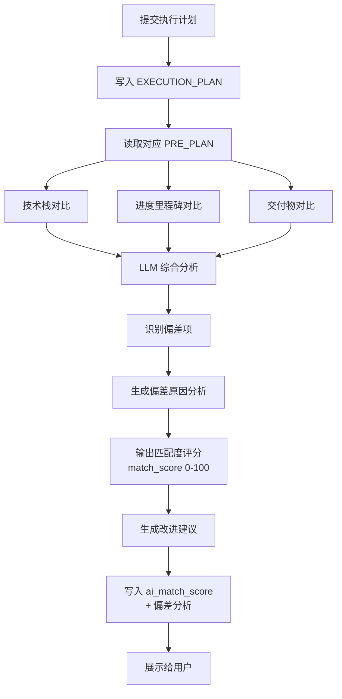
```mermaid
flowchart TD
    A[提交执行计划] --> B[写入 EXECUTION_PLAN]
    B --> C[读取对应 PRE_PLAN]
    C --> D[技术栈对比]
    C --> E[进度里程碑对比]
    C --> F[交付物对比]
    D --> G[LLM 综合分析]
    E --> G
    F --> G
    G --> H[识别偏差项]
    H --> I[生成偏差原因分析]
    I --> J[输出匹配度评分<br/>match_score 0-100]
    J --> K[生成改进建议]
    K --> L[写入 ai_match_score<br/>+ 偏差分析]
    L --> M[展示给用户]
```

---

## 9. 学生评价教师流程

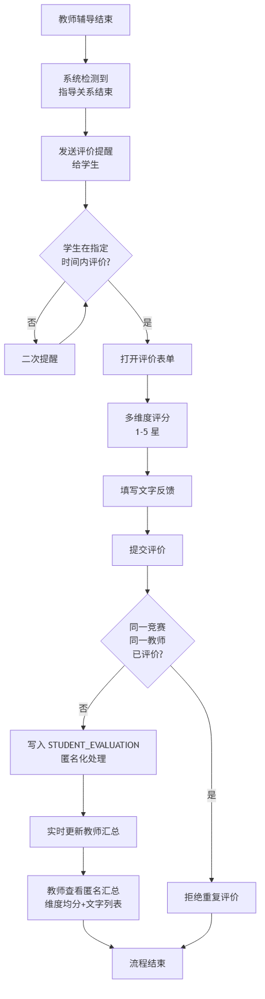

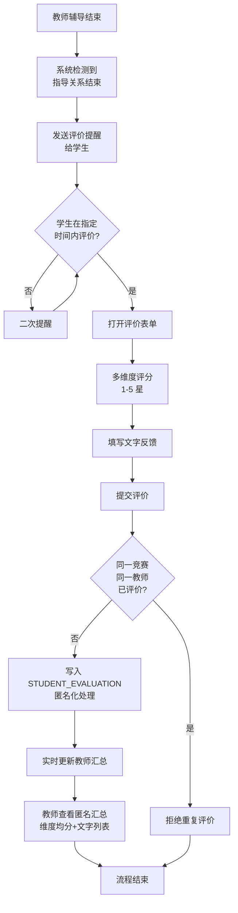
```mermaid
flowchart TD
    A[教师辅导结束] --> B[系统检测到<br/>指导关系结束]
    B --> C[发送评价提醒<br/>给学生]
    C --> D{学生在指定<br/>时间内评价?}
    D -->|否| E[二次提醒]
    E --> D
    D -->|是| F[打开评价表单]
    F --> G[多维度评分<br/>1-5 星]
    G --> H[填写文字反馈]
    H --> I[提交评价]
    I --> J{同一竞赛<br/>同一教师<br/>已评价?}
    J -->|是| K[拒绝重复评价]
    J -->|否| L[写入 STUDENT_EVALUATION<br/>匿名化处理]
    L --> M[实时更新教师汇总]
    M --> N[教师查看匿名汇总<br/>维度均分+文字列表]
    N --> O[流程结束]
    K --> O
```

---

## 10. 获奖结算流程

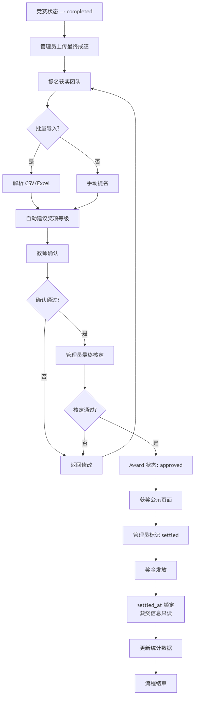

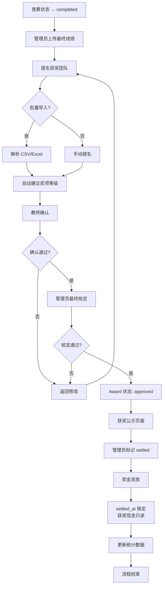
```mermaid
flowchart TD
    A[竞赛状态 → completed] --> B[管理员上传最终成绩]
    B --> C[提名获奖团队]
    C --> D{批量导入?}
    D -->|是| E[解析 CSV/Excel]
    D -->|否| F[手动提名]
    E --> G[自动建议奖项等级]
    F --> G
    G --> H[教师确认]
    H --> I{确认通过?}
    I -->|否| J[返回修改]
    J --> C
    I -->|是| K[管理员最终核定]
    K --> L{核定通过?}
    L -->|否| J
    L -->|是| M[Award 状态: approved]
    M --> N[获奖公示页面]
    N --> O[管理员标记 settled]
    O --> P[奖金发放]
    P --> Q[settled_at 锁定<br/>获奖信息只读]
    Q --> R[更新统计数据]
    R --> S[流程结束]
```

---

## 11. RAG 文档入库与检索流程

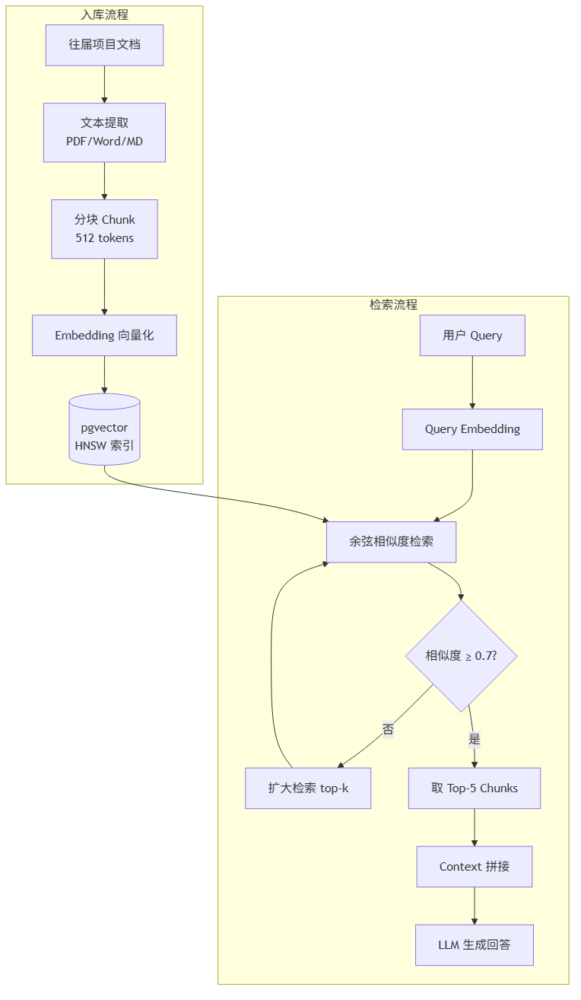

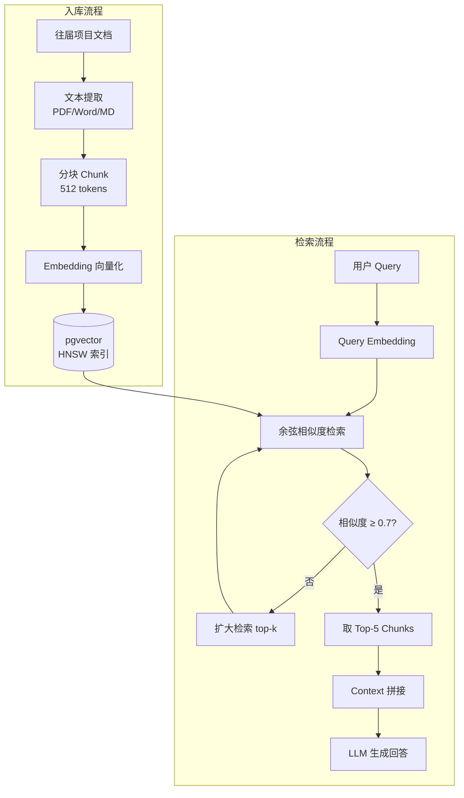
```mermaid
flowchart TD
    subgraph INGEST[入库流程]
        A1[往届项目文档] --> A2[文本提取<br/>PDF/Word/MD]
        A2 --> A3[分块 Chunk<br/>512 tokens]
        A3 --> A4[Embedding 向量化]
        A4 --> A5[(pgvector<br/>HNSW 索引)]
    end

    subgraph QUERY[检索流程]
        B1[用户 Query] --> B2[Query Embedding]
        B2 --> B3[余弦相似度检索]
        A5 --> B3
        B3 --> B4{相似度 ≥ 0.7?}
        B4 -->|否| B5[扩大检索 top-k]
        B5 --> B3
        B4 -->|是| B6[取 Top-5 Chunks]
        B6 --> B7[Context 拼接]
        B7 --> B8[LLM 生成回答]
    end
```

---

## 12. 统计分析数据流

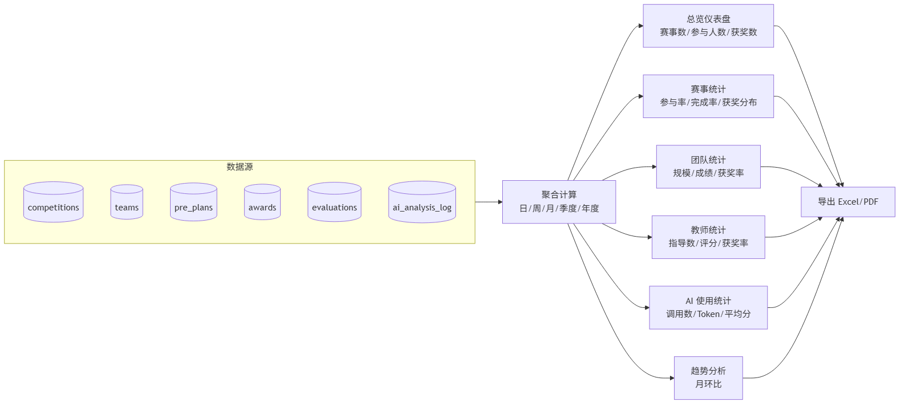

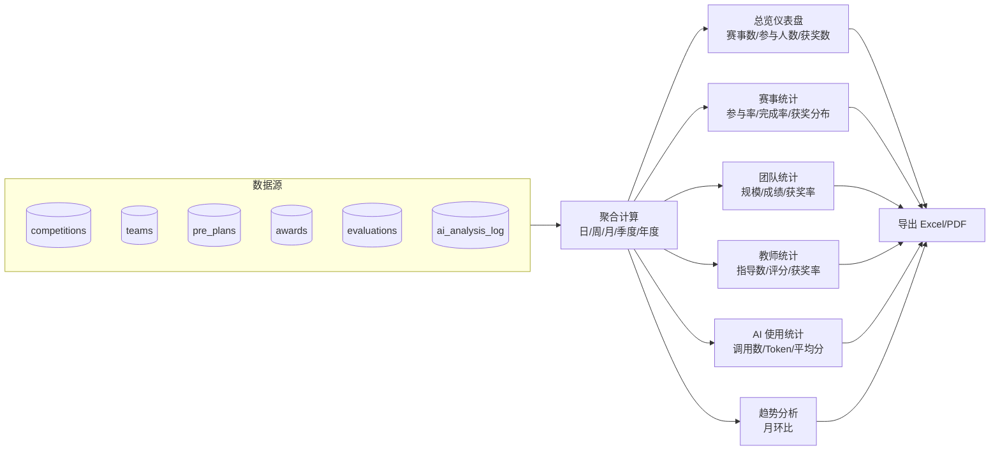
```mermaid
flowchart LR
    subgraph SRC[数据源]
        S1[(competitions)]
        S2[(teams)]
        S3[(pre_plans)]
        S4[(awards)]
        S5[(evaluations)]
        S6[(ai_analysis_log)]
    end

    SRC --> AGG[聚合计算<br/>日/周/月/季度/年度]
    AGG --> D1[总览仪表盘<br/>赛事数/参与人数/获奖数]
    AGG --> D2[赛事统计<br/>参与率/完成率/获奖分布]
    AGG --> D3[团队统计<br/>规模/成绩/获奖率]
    AGG --> D4[教师统计<br/>指导数/评分/获奖率]
    AGG --> D5[AI 使用统计<br/>调用数/Token/平均分]
    AGG --> D6[趋势分析<br/>月环比]
    D1 --> EXP[导出 Excel/PDF]
    D2 --> EXP
    D3 --> EXP
    D4 --> EXP
    D5 --> EXP
    D6 --> EXP
```

---

## 13. AI 辅助工具调用流程

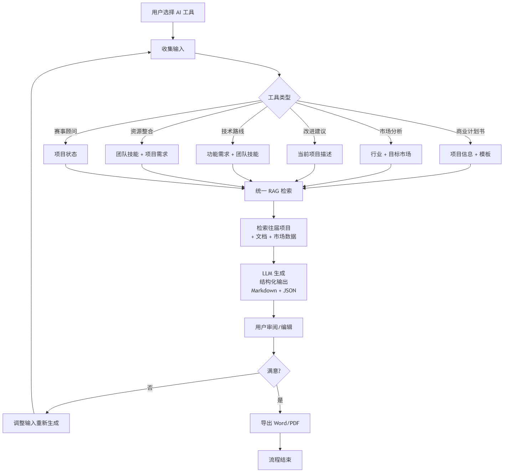

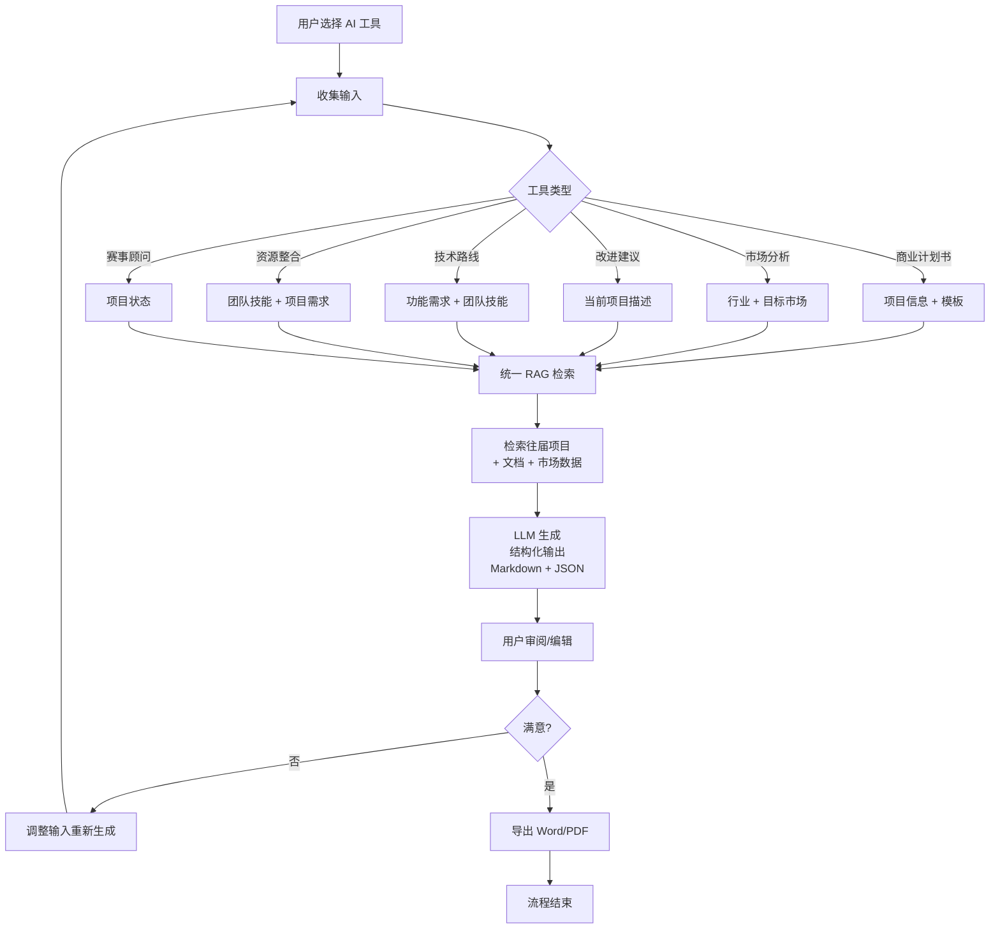
```mermaid
flowchart TD
    A[用户选择 AI 工具] --> B[收集输入]
    B --> C{工具类型}
    C -->|商业计划书| D1[项目信息 + 模板]
    C -->|市场分析| D2[行业 + 目标市场]
    C -->|改进建议| D3[当前项目描述]
    C -->|技术路线| D4[功能需求 + 团队技能]
    C -->|资源整合| D5[团队技能 + 项目需求]
    C -->|赛事顾问| D6[项目状态]

    D1 --> E[统一 RAG 检索]
    D2 --> E
    D3 --> E
    D4 --> E
    D5 --> E
    D6 --> E

    E --> F[检索往届项目<br/>+ 文档 + 市场数据]
    F --> G[LLM 生成<br/>结构化输出<br/>Markdown + JSON]
    G --> H[用户审阅/编辑]
    H --> I{满意?}
    I -->|否| J[调整输入重新生成]
    J --> B
    I -->|是| K[导出 Word/PDF]
    K --> L[流程结束]
```

